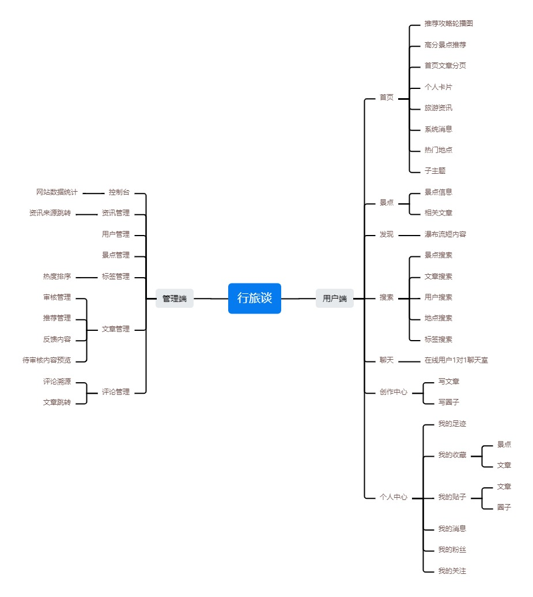

## 行旅谈——基于Springboot和Vue.js前后端分离的在线旅游系统
### 设计初衷
2023年是疫情开放第一年。在三年“动态清零，区域封控”的背景下，大多数人渴望更加自由的生活方式，因此2023年将会是旅游产业、服务产业全面复苏的一年。在这样一个后疫情时代的背景下，我们希望构建面向用户的便捷旅游系统，为用户提供服务。（依托于`Web应用开发技术课程`）
### 系统功能设计

### 技术栈
- **前端：**
  - `Vue`
  - `Axios`
  - `Element UI`
  - `Font Awesome(图标)`
  - `V-region(城市区域选择器)`
  - `Vue-waterfall-easy(瀑布流插件)`
  - `Echarts(可视化工具)`
- **后端：**
  - `SpringBoot`
  - `Mybatis`
  - `MySQL`
  - `JWT`
  - `PageHelper(分页插件)`
  - `Redis`
  - `Lombook`
- **接口：**
  - `腾讯域名解析`
